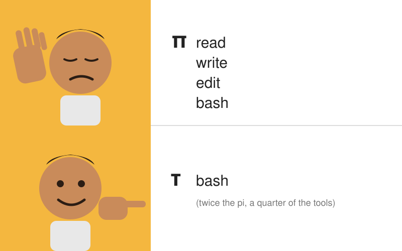

# tau

τ = 2π. It's pi, twice.

[pi](https://github.com/badlogic/pi-mono) is a coding agent with four tools. tau has one, and it can run copies of itself.



## Install

```sh
curl -fsSL https://raw.githubusercontent.com/teddytennant/tau/main/install.sh | sh
```

Linux and macOS, x86_64 and arm64. One static binary lands in `~/.local/bin`. From source: `cargo install --git https://github.com/teddytennant/tau`.

## First run

Type `tau`. It says hello and asks how you want to pay for tokens:

- an API key for Anthropic, OpenAI, xAI or OpenRouter, or any OpenAI-compatible URL for a local server. The key is typed with the characters hidden and checked by listing the provider's models.
- your ChatGPT (Plus, Pro, Team) or xAI account, through the provider's own sign-in page.

Then you pick a default model from the provider's live list. Everything lands in `~/.tau/auth.json`, mode 600, and an `ANTHROPIC_API_KEY` or similar in your environment still wins.

Anthropic is API keys only. It doesn't allow Claude subscriptions in third-party harnesses, so tau doesn't offer that sign-in.

On a box with no browser, like a server over SSH, run `tau login chatgpt` or `tau login xai`. It prints the URL; open it on your laptop, let the last redirect fail to load, and paste that page's address back. Or forward the port it names with `ssh -L`.

## Run

```sh
tau                            # the TUI
tau "fix the flaky test"       # the TUI, starting with that message
tau -p "fix the flaky test"    # headless: answer on stdout, progress on stderr
tau -c                         # continue the last session in this directory
tau -r                         # pick an earlier session
tau login                      # add or change a provider
tau login chatgpt              # sign in with an account, works over SSH
tau update                     # replace this binary with the latest release
```

In the TUI, `@` inlines a file, `!cmd` runs a command and puts its output in the context, and `/` lists the commands. Typing while it works steers the next turn. esc interrupts. `/help` has the rest, and [docs/features.md](docs/features.md) has the long list.

## The whole system prompt

This is all of it, about 190 words. The working directory, every `AGENTS.md` (or `CLAUDE.md`) from `/` down to it, and the names of your skills get appended.

```text
You are tau, a coding agent in a terminal. You have one tool, bash, and it is enough: read with cat, sed -n and rg, write files with heredocs, run the tests, use git.

To change part of a file, use tau edit with exact text:
tau edit path/to/file <<'EOF'
<<<<<<< SEARCH
exact old lines
=======
new lines
>>>>>>> REPLACE
EOF

A command that outlives its timeout keeps running as a job: tau job list, wait, tail or kill.

Make your own tools. An executable you put in ~/.tau/bin is on PATH from then on, in every session. Executables in ~/.tau/panels print into a side panel of the UI, and ones in ~/.tau/commands become /slash commands. Write one when you notice you are repeating yourself.

You can run copies of yourself. tau -p "task" runs one and prints its answer. Add --from $TAU_NODE to give it everything you know so far. Start several with & and wait for them. Use copies for independent pieces of work.

Read before you edit. Check your work by running it. When you are done, say what changed and how you know it works, briefly.
```

## One tool

The model gets one function, `bash`. Long output is cut to the first and last 60 lines, and the full text is saved to a file it can `cat`. A command still running after two minutes becomes a job instead of getting killed. `tau edit` and `tau job` are subcommands, so the model calls them through bash like any other program. Ctrl+c kills the whole process group, not just the shell.

## It copies itself

`tau -p "task"` is an ordinary command, so the model can run it. `--from $TAU_NODE` starts the copy with everything the parent has seen, and since the log is append-only, the copy's first request reuses the parent's cached prefix. A copy costs about as much as one more turn.

Every copy gets `TAU_DEPTH` one higher than its parent, and past `TAU_MAX_DEPTH` (default 3) a copy refuses to start, so a model that gets excited can't fork-bomb you.

## It writes its own tools

There is no plugin API. There are three directories, and the model can write into all of them.

`~/.tau/bin` is on the model's PATH. A script it writes there is still there next session.

`~/.tau/panels/NAME` runs after every event with `TAU_EVENTS` set to the session log. Whatever it prints shows up in a side panel of the TUI.

`~/.tau/commands/NAME` becomes `/NAME`. Its stdout is sent as your message, and its stderr is only shown to you.

Any language works, and all three are picked up without a restart. Try "make me a panel that shows git status".

## Sessions

Each session is an append-only JSONL log in `~/.tau/sessions`. Every event points at its parent, so the log is a tree, and what the model sees is a pure function of the log and a head node. `/tree` moves the head, `/fork` copies a branch into a new session, and compaction adds a summary node that the next request starts from. Nothing is deleted, and until something is compacted the cached prefix never changes.

## No sandbox

tau runs whatever the model writes, as you. If that bothers you, run it in a container.

## License

MIT
